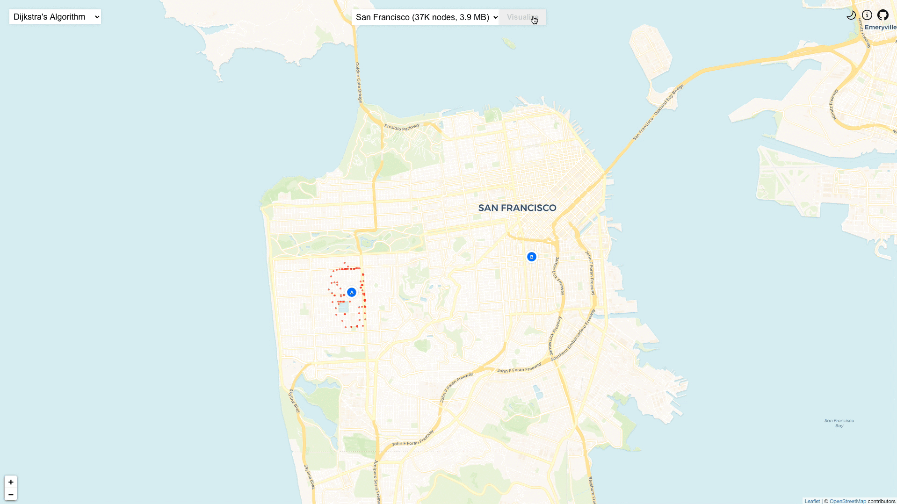

<h1>Pathfinding Visualizer</h1>

## [Try it out](https://pathfinding.kelvinzhang.ca/)



This is a pathfinding visualizer that I made while learning common pathfinding algorithms like Dijkstra's, A*, and Greedy Best First Search. Below you can find some design decisions that went into making this project.

# Algorithms and Cities
- **Supported Algorithms**
    - **Dijkstra**: Optimized breadth-first search that prioritizes exploring lower-cost paths.
        - *(weighted, shortest path guaranteed)*
    - **A\***: Optimized Dijkstra for when we know end node location. Uses lat/long distance as heuristic.
        - *(weighted, shortest path guaranteed)*
    - **Greedy Best-First Search**: Faster version of A* that doesn't guarantee shortest path 
        - *(weighted, shortest path not guaranteed)*
    - **Breadth First Search**: Explores all nodes equally in all directions, level-by-level
        - unweighted, shortest path guaranteed
    - **Depth First Search**: Explores as far as possible along each branch before backtracing
        - unweighted, shortest path not guaranteed
- **Supported Cities**
    - San Francisco (37k nodes, 3.9MB)
    - Vancouver (24k nodes, 2.5MB)
    - New York (177k nodes, 17.7MB)
    - Waterloo (22k nodes, 2.0MB)


# How I made this
**Table of contents**
* [Data preparation](https://github.com/0kzh/pathfinding-visualizer#data-preparation)
* [Loading the graph](https://github.com/0kzh/pathfinding-visualizer#loading-the-graph)
* [Rendering](https://github.com/0kzh/pathfinding-visualizer#rendering)
* [Async everything](https://github.com/0kzh/pathfinding-visualizer#async-everything)
* [Hit testing](https://github.com/0kzh/pathfinding-visualizer#hit-testing)
* [Pathfinding](https://github.com/0kzh/pathfinding-visualizer#pathfinding)
* [Developing locally](https://github.com/0kzh/pathfinding-visualizer#developing-locally)

## Data preparation
Data generated and stored in this repository comes from www.openstreetmap.org
(available under the [ODbL](https://opendatacommons.org/licenses/odbl/) license).

[BBBike](https://extract.bbbike.org/) was used to extract regional data as an array of nodes. This data was then run through a Python script to turn it into an undirected graph. During this step, BFS was performed to extract the largest possible connected graph from the dataset.

In the output format, each road is an edge and each intersection is a node. An adjacency list keeps track of directly-connected nodes.
```json
{
    "7402583179":{
        "lat": 49.246429443359375,
        "lon": -123.0760498046875,
        "adj": [
            "630211867",
            "343340007"
        ]
    },
}
```

## Loading the graph
Since the data for cities can be very large (for example, New York is nearly 18 MB), loading the data needed to be done on-demand. Progress callbacks were used to track the status of a download request
```typescript
const { data: jsonData } = await axios.get(
      `https://pathfinding.kelvinzhang.ca/data/${file}`,
      {
        onDownloadProgress: (progressEvent) => {
          const percentage = Math.round(
            (progressEvent.loaded * 100) / progressEvent.total
          );
          onProgress(percentage);
          if (percentage >= 100) {
            setTimeout(() => {
              setLoading(false);
              cityData[city].loaded = true;
            }, 400);
          }
        },
      }
    );
```

## Rendering
To draw the map, [React Leaflet](https://react-leaflet.js.org/) was used. I was initially going to use Google Maps, but support for React was limited and it wasn't that extensible. [CartoCDN](https://carto.com/help/building-maps/basemap-list/) tiles were used in the styling of the map.

To visualize pathfinding progress, visited nodes needed to be drawn on the screen. However, at the same time, we cannot have a separate SVG element for each node when showing 150k+ elements - that would be impossibly slow. One workaround would be to render everything on a canvas, but there was no built-in library for that. Instead, I built my [own library](https://github.com/0kzh/pathfinding-visualizer/blob/master/src/lib/react-leaflet-canvas-markers/CanvasMarkersLayer.js) to render a canvas layer for markers.

Still, rendering every single node caused a lot of lag and the app would often freeze. For algorithms such as BFS, each layer/iteration introduces exponentially more nodes than the last. Because of this, only some nodes are flagged for rendering.

## Async everything
Running pathfinding on a large dataset of nodes takes a while, especially for unefficient algorithms like DFS and BFS. Because of this, rendering would often freeze and I needed to make everything asyncronous. Passing data within the application would cause a lot of unnecessary re-renders, so I offloaded tasks to WebWorkers.

## Hit testing
At this point, we discussed how data is loaded and how it's rendered. But how do we determine which node is being clicked? How can we click somewhere to set the start/end point and have it snap to the nearest node?

A naive solution would be to iterate through all the points and find the nearest point to our click. This would be a decent solution with a thousand points or less, but in our case, with several hundred thousands of points, it would be very slow.

A [QuadTree](https://en.wikipedia.org/wiki/Quadtree) was used to build an index of points. After a QuadTree is created, it can be queries in logarithmic time for the nearest neighbors around any coordinate. It's similar to a binary tree, but with four children instead.

## Pathfinding
Currently, these pathfinding algorithms are supported
- **Dijkstra**: Optimized breadth-first search that prioritizes exploring lower-cost paths.
    - *(weighted, shortest path guaranteed)*
- **A\***: Optimized Dijkstra for when we know end node location. Uses lat/long distance as heuristic.
    - *(weighted, shortest path guaranteed)*
- **Greedy Best-First Search**: Faster version of A* that doesn't guarantee shortest path 
    - *(weighted, shortest path not guaranteed)*
- **Breadth First Search**: Explores all nodes equally in all directions, level-by-level
    - unweighted, shortest path guaranteed
- **Depth First Search**: Explores as far as possible along each branch before backtracing
    - unweighted, shortest path not guaranteed

**Weighted vs Unweighted**  
You'll notice that some of the algorithms listed above are weighted, while others are unweighted.

The weighted algorithms use the [Manhattan distance](https://en.wiktionary.org/wiki/Manhattan_distance) heuristic, which calculates the sum of horizontal and vertical (read: lateral and longitudinal) distances between two nodes. In other words, the shortest path will have the least *physical distance* between the two nodes.

Unweighted algorithms give all edges the same weight of 1. In other words, the shortest path will have the least amount of nodes.

**Calculating performance**  
Performance was calculated using a pausable [timer](https://www.npmjs.com/package/timer-machine). To simulate pathfinding speed, delays were added between iterations. This means that the timer only runs during calculations and is paused during rendering delays. For this reason, the total time to find the path is much smaller than what you see on the screen.

## Developing locally
If you'd like to play around with the code:
```bash
# install dependencies
npm install

# serve with hot reload at localhost
npm start

# building for production
npm run build
```

## Thank you
Thanks for reading this! I hope you enjoyed it as much as I enjoyed working on this project.